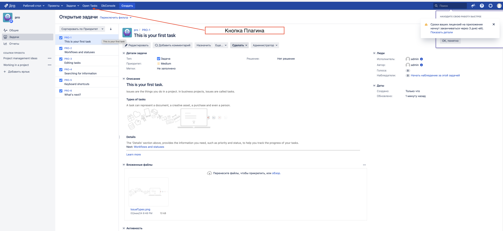
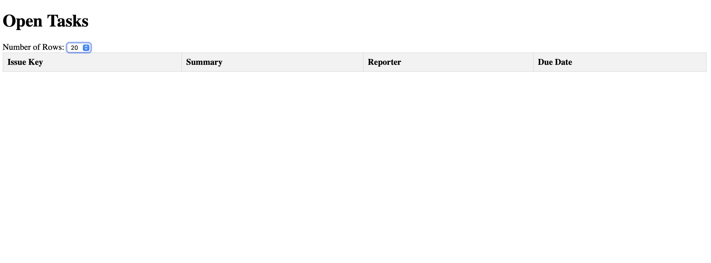

# PluginJira

PluginJira is a Jira plugin that displays a table with information about open tasks. The table includes the following fields:

- Issue Key
- Summary
- Reporter
- Due Date

The user can sort the table by clicking on any of the column headers.

## Installation

To install PluginJira, follow these steps:

1. Clone the repository: `git clone` [ https://github.com/MardeevRuslan/PluginJira.git](https://github.com/MardeevRuslan/PluginJira)
2. Navigate to the project directory: `cd PluginJira/myPlugin`
3. Build and run the plugin: `atlas-run`
